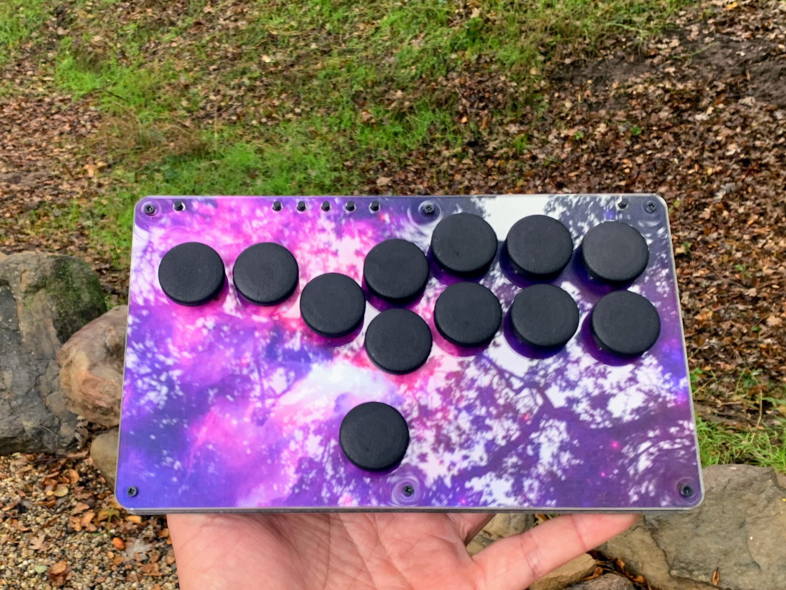

# hitFIGHTER
All-button fighting controller running GP2040-ce firmware

More firmware info available at GP2040-CE.info. To put the unit in config mode press S2/Start while plugging in USB. Please note only windows supports web config. See https://gp2040-ce.info/#/web-configurator

